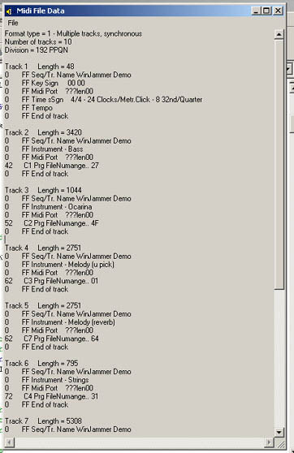



## Midi File Reader

### Description

This code is a re-write of the module "midi" in the PSC code entry "Advanced Midi Programming / Utility"

i was looking for a Midi file reader to read all the file's data in notes, control notations, and be able to extract comments in the files etc., i found this code that could do so but it was unreadeable (the code i used as a template to re-write was the original, which is in the project as ModOriginal) so i re-wrote it so other's could learn what i wanted to learn (unfortunately some of the byte translations are still in dutch, i couldn't translate Some of them, most are in english and the routines and helper routines are in english.)

EDIT: My Code is in ClsMidi, compare it with the code in ModOriginal to see it's advantages for learning!

Also thanks to peter wilson, i stole his space oddysey midi :p
 
### More Info
 
Need to know just a little about file structures and reading to be able to understand .

             |
---                |---
**Submitted On**   |2003-08-08 12:21:54
**By**             |[Steven Paterson](https://github.com/Planet-Source-Code/PSCIndex/blob/master/ByAuthor/steven-paterson.md)
**Level**          |Intermediate
**User Rating**    |4.7 (28 globes from 6 users)
**Compatibility**  |VB 6\.0
**Category**       |[Sound/MP3](https://github.com/Planet-Source-Code/PSCIndex/blob/master/ByCategory/sound-mp3__1-45.md)
**World**          |[Visual Basic](https://github.com/Planet-Source-Code/PSCIndex/blob/master/ByWorld/visual-basic.md)
**Archive File**   |[Midi\_File\_162619882003\.zip](https://github.com/Planet-Source-Code/steven-paterson-midi-file-reader__1-47516/archive/master.zip)

